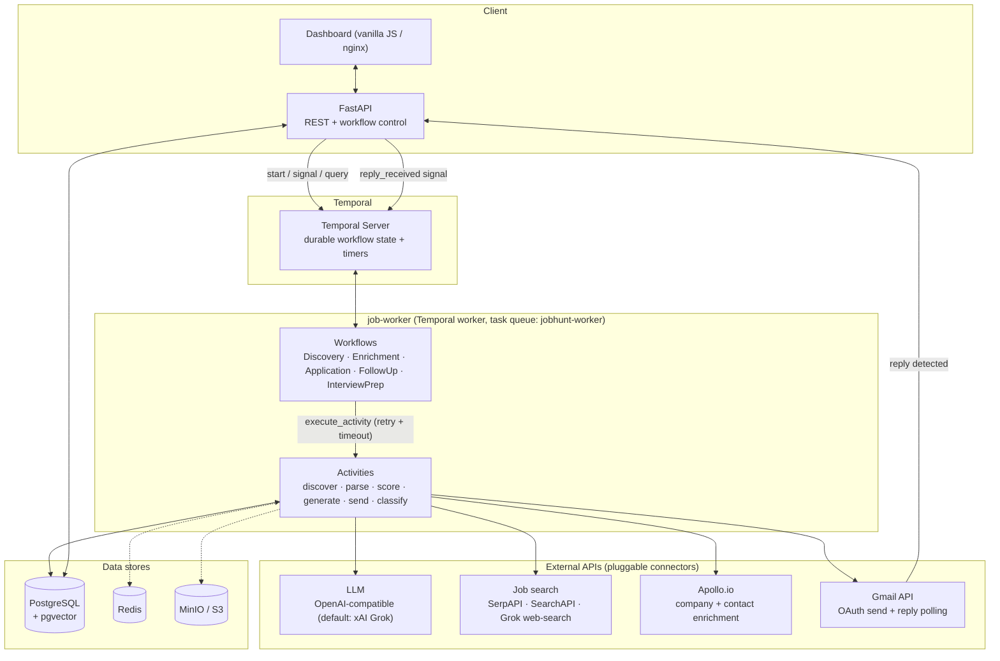
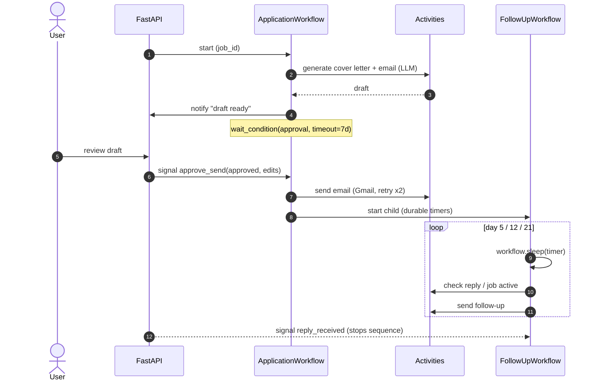

# Temporal Agentic Application Pipeline

A **durable, human-in-the-loop job-application pipeline** built on
[Temporal](https://temporal.io). Long-running workflows discover roles, score them
against a candidate profile with an LLM, draft tailored outreach, **pause for human
approval**, send via Gmail, and then run a multi-week follow-up sequence on durable
timers — all crash-safe, resumable, and observable. The interesting engineering isn't
"a bot that applies to jobs"; it's the orchestration substrate: signals, queries,
retries with backoff, idempotent activities, deterministic workflow IDs, and a
provider-agnostic LLM layer wired to pluggable external-API connectors.

> **What this is, honestly:** an application pipeline used as a vehicle to build
> production-shaped agentic orchestration. The Temporal layer (signals/queries/timers/
> retries/HITL gate/child workflows) is complete and real. A few enrichment activities
> are explicit placeholders — see [Status: implemented vs roadmap](#status-implemented-vs-roadmap).

---

## Architecture



The **email poller** watches Gmail for replies and signals the running
`FollowUpWorkflow` (`reply_received`) so the sequence stops the moment a human responds.

---

## How it works (end-to-end lifecycle)

1. **Discover** — `JobDiscoveryWorkflow` runs from a saved search config (or synthesizes
   one from the candidate's resume), queries the job connectors, **dedupes** against
   existing rows (`ON CONFLICT`), and persists new postings.
2. **Enrich** — `JobEnrichmentWorkflow` adds company data + hiring contacts (Apollo) and
   computes a detailed fit score. It **skips already-enriched jobs** unless `force_refresh`.
3. **Match** — an LLM scores each job against the profile (0–100) with matched/missing
   skills and reasoning; a cheap keyword pre-filter gates the expensive LLM call.
4. **Draft** — `ApplicationWorkflow` generates a cover letter + outreach email, finds the
   best contact, saves a draft, and **notifies the user**.
5. **Approve (human-in-the-loop)** — the workflow blocks on
   `await workflow.wait_condition(... , timeout=7 days)` until the user sends an
   `approve_send(approved, edits)` signal (or `cancel_application`). It can apply the
   user's edits before sending. `auto_send=True` bypasses the gate.
6. **Send** — the approved email goes out via Gmail; an application record is created.
7. **Follow up** — `ApplicationWorkflow` spawns a `FollowUpWorkflow` child
   (`followup-{application_id}`) that uses **durable timers** to run a day-5 / day-12 /
   day-21 cadence, exiting early on `reply_received`, `stop_sequence`, or a job-closed check.
8. **Prep** — `InterviewPrepWorkflow` researches the company + interviewers and generates
   likely questions and talking points.



---

## Why these design decisions

- **Why Temporal?** The work is inherently long-running and human-gated: an application can
  sit for *days* awaiting approval, and follow-ups span *weeks*. Encoding that as durable
  workflows means a worker crash, redeploy, or restart loses nothing — timers, approval
  state, and progress are persisted by Temporal, not held in memory or a fragile cron + DB
  flag. A 21-day follow-up is just `await workflow.sleep(timedelta(days=...))`.
- **Why human-in-the-loop?** Outreach is irreversible and reputational. The approval gate
  (`wait_condition` + signal) makes "draft, then a human approves/edits, then send" a
  first-class state rather than a hopeful `if` check, with a 7-day timeout so abandoned
  drafts expire cleanly.
- **How retries & idempotency are handled:**
  - Activities run under a `RetryPolicy` (exponential backoff, capped attempts); email
    sends use a tighter policy (2 attempts) to avoid duplicate outreach.
  - **Deterministic workflow IDs** (`application-{job_id}`, `followup-{application_id}`)
    make starts idempotent — the same job can't spawn duplicate pipelines.
  - DB writes use `ON CONFLICT` upserts (jobs by `external_id`, companies by `domain`,
    contacts by `email`); enrichment is skipped when `enriched_at` is set.
  - **Belt-and-suspenders reply detection:** the follow-up loop honors the
    `reply_received` signal *and* re-checks the database after each timer, so a missed
    signal can't cause an unwanted follow-up.
- **Why a provider-agnostic LLM layer?** All model config lives in
  [`utils/llm_config.py`](job-worker/utils/llm_config.py). It targets any
  OpenAI-compatible endpoint (default: xAI Grok) via `LLM_BASE_URL` / `LLM_MODEL` /
  `LLM_API_KEY` — swap to OpenAI or a local server with env vars, no code changes.
- **Why config-driven identity?** The candidate's name, contact info, background, and
  resume live in a YAML profile ([`profile.example.yaml`](profile.example.yaml)), never in
  code — so the repo is shareable and prompts/signatures are built at runtime from config.

---

## The workflows

| Workflow | Signals | Queries | Durability mechanics |
|---|---|---|---|
| **JobDiscoveryWorkflow** | `cancel_discovery` | `get_progress` | retry policy on every activity; dedupe via DB upsert; resume-driven synthesis |
| **JobEnrichmentWorkflow** | — | `get_status` | idempotent skip on `enriched_at`; company cache by domain; `force_refresh` |
| **ApplicationWorkflow** | `approve_send(approved, edits)`, `cancel_application` | `get_draft`, `get_status` | **HITL approval gate** (`wait_condition`, 7-day timeout); spawns follow-up child |
| **FollowUpWorkflow** | `reply_received`, `stop_sequence`, `pause_sequence`, `resume_sequence` | `get_status` | **durable timers** (5/12/21-day cadence); signal + DB reply checks |
| **InterviewPrepWorkflow** | — | `get_status` | per-interviewer research with graceful degradation |

---

## Tech stack

- **Orchestration:** Temporal (Python SDK) — workflows, activities, signals, queries, timers
- **API:** FastAPI + Uvicorn
- **LLM:** any OpenAI-compatible endpoint via the OpenAI SDK (default: xAI Grok)
- **Connectors:** SerpAPI / SearchAPI (Google Jobs), Apollo.io, Gmail API (OAuth2)
- **Data:** PostgreSQL + pgvector, Redis, MinIO (S3-compatible)
- **Frontend:** dependency-free vanilla JS dashboard served by nginx
- **Infra:** Docker Compose (local) / Compose over shared infra (prod)

---

## Quickstart

```bash
# 1. Configure environment (all keys are optional for a first boot)
cp .env.example .env

# 2. (Optional) Customize the candidate profile used in prompts + matching.
#    Without this, generic placeholder defaults are used.
cp profile.example.yaml data/profile.yaml   # gitignored; edit with your details

# 3. Bring up the full stack
docker compose up -d

# Dashboard:    http://localhost:8084
# API + docs:   http://localhost:8080/docs
# Temporal UI:  http://localhost:8088
```

To actually run discovery/enrichment/outreach you'll need API keys in `.env`
(`LLM_API_KEY`/`XAI_API_KEY`, `SERPAPI_KEY`, `APOLLO_API_KEY`, and Gmail OAuth). The stack
boots and the dashboard/API/Temporal UI are usable without them.

### Configuration

| Concern | Where | Notes |
|---|---|---|
| LLM provider | `LLM_BASE_URL` / `LLM_MODEL` / `LLM_API_KEY` | OpenAI-compatible; defaults to xAI Grok |
| Candidate identity | `profile.yaml` / `PROFILE_PATH` | name, contact, background, resume — never in code |
| Job search | `SERPAPI_KEY` / `SEARCHAPI_KEY` | Google Jobs connectors |
| Enrichment | `APOLLO_API_KEY` | company + contact data |
| Email | `GOOGLE_CLIENT_ID/SECRET`, `OAUTH_MASTER_KEY` | Gmail OAuth; tokens encrypted at rest |

---

## Project structure

```
.
├── job-worker/                  # FastAPI app + Temporal worker
│   ├── workflows/               # 5 Temporal workflows (the orchestration layer)
│   ├── activities/              # Temporal activities (discover, score, generate, send)
│   ├── clients/                 # External API connectors (SerpAPI, Apollo, Gmail, Grok)
│   ├── routes/                  # FastAPI endpoints (jobs, applications, workflows, ...)
│   ├── utils/                   # llm_config, profile, matching, content formatting
│   ├── prompts/                 # LLM prompt templates (candidate details injected at runtime)
│   ├── worker.py                # Registers workflows + activities on the task queue
│   └── main.py                  # FastAPI entry point
├── frontend/                    # Vanilla-JS dashboard (nginx)
├── db/migrations/               # Numbered SQL migrations
├── profile.example.yaml         # Candidate profile template (copy to profile.yaml)
├── docker-compose.yml           # Local dev stack
└── .env.example                 # Environment template (no secrets)
```

---

## Status: implemented vs roadmap

**Fully implemented**

- The entire Temporal orchestration layer: 5 workflows, signals, queries, the HITL
  approval gate, durable timers, child workflows, retry policies, deterministic IDs.
- Job discovery (SerpAPI / SearchAPI / Grok web-search), parsing, dedupe.
- LLM fit-scoring, cover-letter / outreach-email / resume-bullet generation.
- Gmail send (`activities.email.send_outreach_email`), reply polling + sentiment
  classification, application + follow-up tracking.
- FastAPI surface, the dashboard, and the full database schema (16 migrations).

**Placeholders / roadmap** (clearly marked in code with structured stub returns)

- `send_application_email` / `send_follow_up_email` are thin wrappers; the real,
  implemented sending path is `activities.email.send_outreach_email`.
- Interview/company deep-research activities (`research_company_recent`,
  `research_interviewer`, `research_company_culture`) return `pending_integration` stubs.

---

## Why I built this

I wanted a real, production-shaped system to reason about **durable agentic
orchestration** — not a toy. Job applications turned out to be a perfect forcing
function: the work is long-running (weeks of follow-ups), human-gated (you must approve
outreach), failure-prone (third-party APIs, email), and only useful if it's *exactly
once* and crash-safe. That maps cleanly onto Temporal's primitives, so building it end to
end — workflows, signals, durable timers, idempotent activities, a provider-agnostic LLM
layer, and pluggable connectors — was a way to practice the patterns that matter for
agentic platforms in general, with honest tradeoffs and clear proofs.

## License

[MIT](LICENSE)
